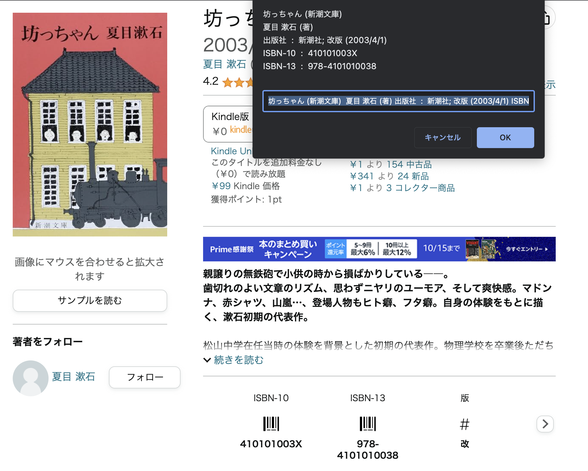

# ExtractBookInfoFromAmazon

Amazonの個々の書籍のページから、書籍名、著者名、出版社、ISBNの情報を抜き出します。



### 使い方：

1. 以下のコードを選択してコピーします。

   ```javascript
   javascript:(function(d){s=d.createElement('script');s.src='https://atsuhiko-maeda.github.io/ExtractBookInfoFromAmazon/extractBookInfoFromAmazon.js';d.body.appendChild(s);})(document)

2. ブラウザのブックマークバーに新しいブックマークを作成します。
3. タイトルを好きな名前に設定し、URLまたはアドレスフィールドに先程コピーしたコードをペーストし、保存します。
4. その後は、Amazonの個々の書籍のページを開き、作成したブックマークをクリックすると、情報が抽出されます。
